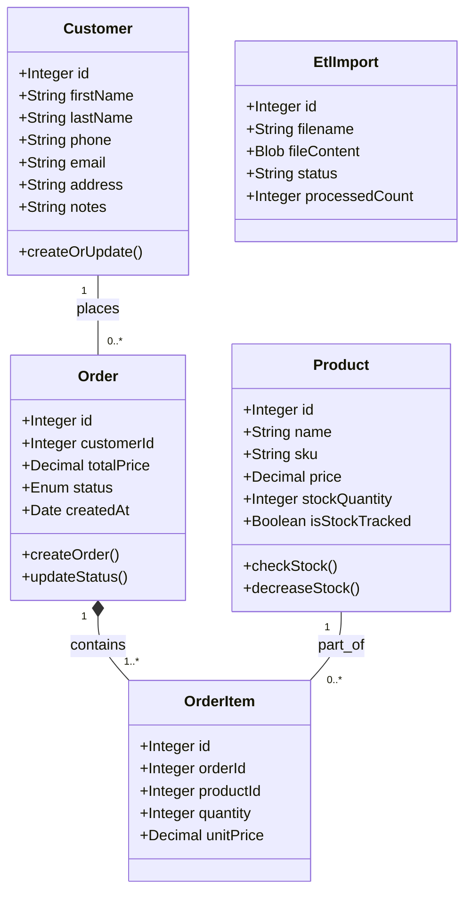
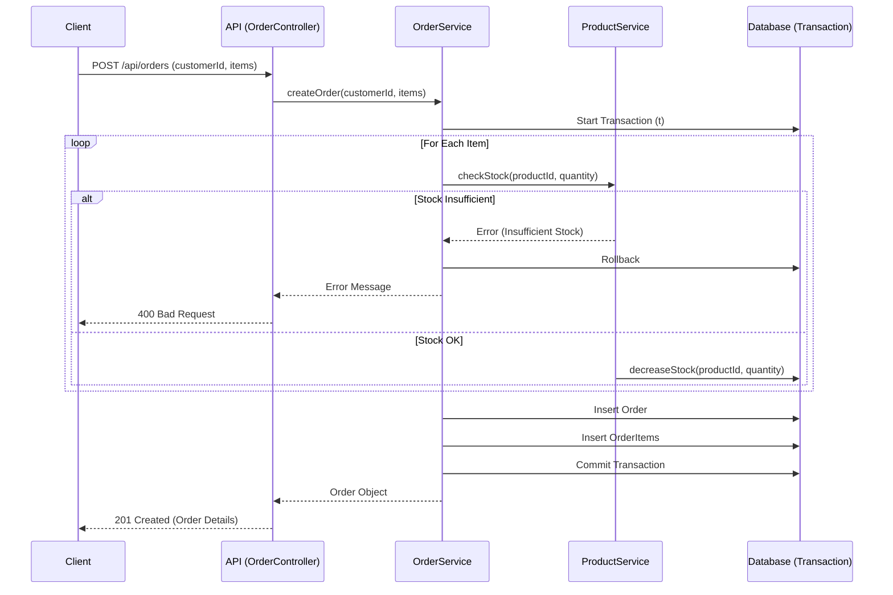

# UML Diyagramları

## 1. Class Diagram (Sınıf Diyagramı)
Sistemin veri modelleri ve aralarındaki ilişkileri gösterir.



## 2. Sequence Diagram (Sipariş Oluşturma Senaryosu)
Bir siparişin API'den veritabanına kadar olan akışını ve stok kontrolünü gösterir.



## 3. Use Case Diagram (Kullanım Durumları)
Sitemdeki aktörlerin (Admin/Kullanıcı) yapabileceği temel işlemleri gösterir.

```mermaid
useCaseDiagram
    actor Admin as "Yönetici / Personel"

    package "MiniCRM System" {
        usecase "Müşteri Ekle/Güncelle" as UC1
        usecase "Müşteri Ara" as UC2
        usecase "Ürün Ekle" as UC3
        usecase "Stok Güncelle" as UC4
        usecase "Sipariş Oluştur" as UC5
        usecase "Sipariş Durumu Değiştir" as UC6
        usecase "Toplu Veri Yükle (ETL)" as UC7
        usecase "Raporları Görüntüle" as UC8
    }

    Admin --> UC1
    Admin --> UC2
    Admin --> UC3
    Admin --> UC4
    Admin --> UC5
    Admin --> UC6
    Admin --> UC7
    Admin --> UC8
```
